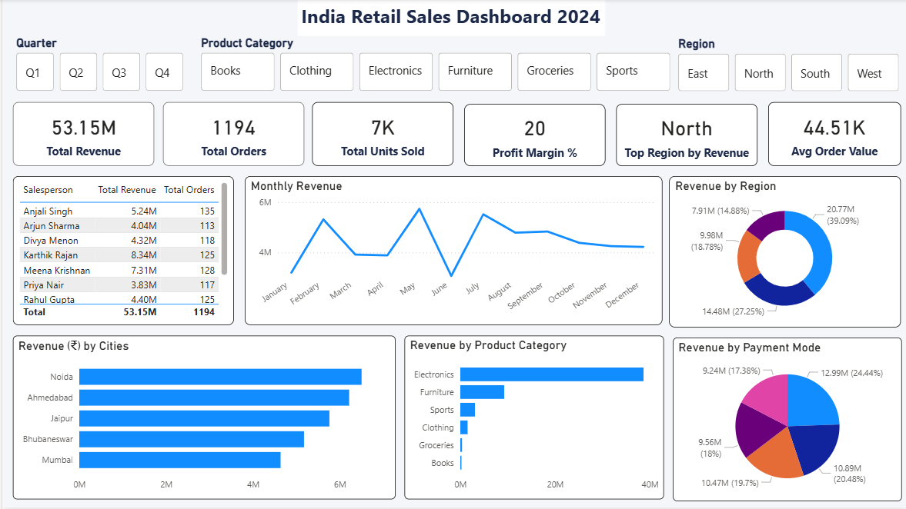

# 🛒 India Retail Sales Dashboard — Power BI

An interactive Power BI dashboard analyzing all-India retail sales performance across 6 product categories, 12 cities, and 4 regions for the year 2024.

---

## 📊 Dashboard Preview



---

## 🔧 Tools Used

- **Power BI Desktop** — Dashboard & Visualizations
- **Power Query** — Data Cleaning & Transformation
- **DAX** — Measures & KPIs

---

## 🧹 Data Cleaning (Power Query)

The raw dataset contained 7 data quality issues — all resolved using Power Query:

| # | Issue | Fix Applied |
|---|-------|-------------|
| 1 | Inconsistent city names (mumbai, MUMBAI, Bombay) | Capitalize Each Word |
| 2 | Null values in Revenue column | Replaced with 0 |
| 3 | Null values in Profit column | Replaced with 0 |
| 4 | Duplicate Order IDs | Removed Duplicates |
| 5 | Mixed date formats (DD-MM-YYYY vs YYYY-MM-DD) | Standardized to Date type |
| 6 | Negative Profit values | Absolute Value applied |
| 7 | Text prefix in Unit Price (₹48000) | Removed ₹ prefix, converted to Number |

---

## 📐 DAX Measures

### Basic
- `Total Revenue = SUM('Retail Sales Data'[Revenue (₹)])`
- `Total Orders = COUNTROWS('Retail Sales Data')`
- `Total Profit = SUM('Retail Sales Data'[Profit (₹)])`
- `Avg Order Value = DIVIDE([Total Revenue], [Total Orders])`

### Intermediate
- `Profit Margin % = DIVIDE([Total Profit], [Total Revenue]) * 100`
- `Total Units Sold = SUM('Retail Sales Data'[Units Sold])`
- `Top Region by Revenue = MAXX(TOPN(1, SUMMARIZE(...), [Rev], DESC), [Region])`
- `Q4 Revenue = CALCULATE([Total Revenue], 'Retail Sales Data'[Quarter] = "Q4")`
- `MoM Growth % = VAR CurrentMonth = [Total Revenue] VAR PrevMonth = CALCULATE([Total Revenue], DATEADD([Date], -1, MONTH)) RETURN DIVIDE(CurrentMonth - PrevMonth, PrevMonth) * 100`

---

## 📈 Dashboard Features

- **6 KPI Cards** — Total Revenue, Orders, Units Sold, Profit Margin %, Top Region, Avg Order Value
- **Monthly Revenue Trend** — Line Chart (Jan–Dec 2024)
- **Revenue by Region** — Donut Chart (North/South/East/West)
- **Top 5 Cities** — Bar Chart
- **Revenue by Product Category** — Bar Chart
- **Revenue by Payment Mode** — Pie Chart
- **Salesperson Performance** — Table
- **3 Interactive Slicers** — Quarter, Product Category, Region

---

## 🔍 Key Insights

- 📌 Electronics drives 75%+ of total revenue
- 📌 North region leads with 39% sales share
- 📌 Karthik Rajan is the top performing salesperson
- 📌 Net Banking is the most used payment mode (24.44%)

---

## 📁 Dataset

| Detail | Info |
|--------|------|
| Rows | 1,200 |
| Columns | 19 |
| Period | Jan–Dec 2024 |
| Cities | 12 Indian cities |
| Categories | Electronics, Furniture, Clothing, Groceries, Sports, Books |

---

## 🗂 Repository Structure

```
all-indian-retail-sales-performance/
├── README.md
├── data/
│   └── India_Retail_Sales_MESSY.xlsx
├── dashboard/
│   └── India_Retail_Sales_Dashboard.png
└── India_Retail_Sales_Dashboard.pbix
```

---

## 💼 About Me

Aspiring Data Analyst | Excel • Power BI • SQL • Python

LinkedIn - <a href="https://www.linkedin.com/in/sathiya-priyan-da/">Sathya Priyan</a>

📧 Open to Data Analyst opportunities in Bangalore, Chennai, Coimbatore

[](https://linkedin.com/in/your-profile)
[](https://github.com/priyan5295)
